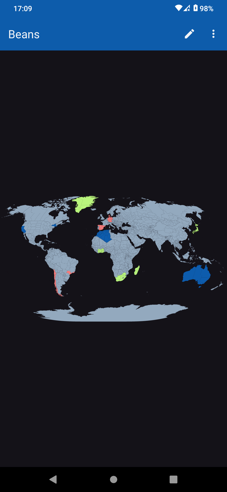
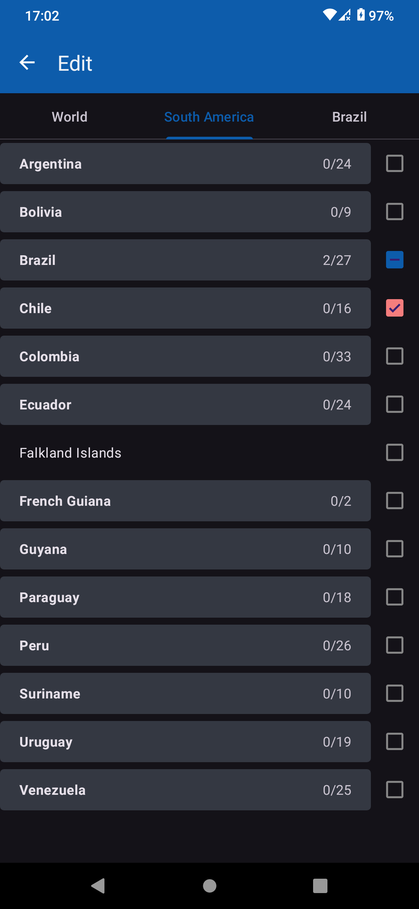
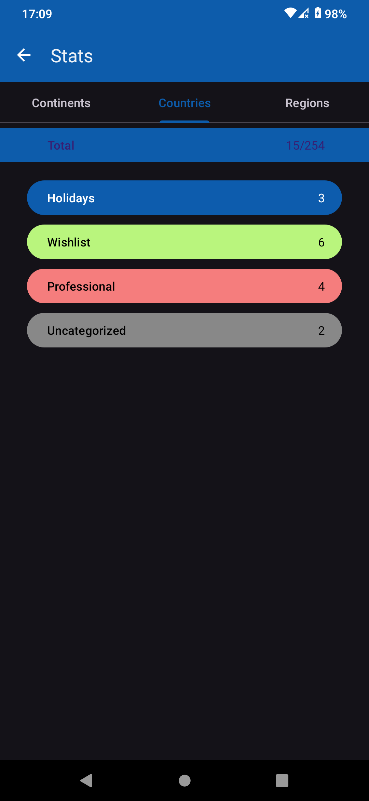
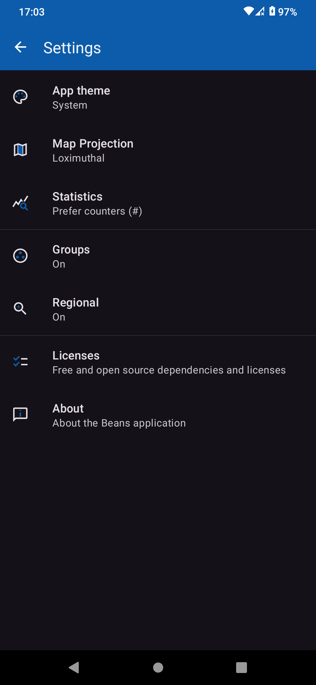

<!--suppress ALL -->
<div align="center">
  <h1>Beans</h1>
  
  
  <p>A virtual scratchmap of the world</p>
  
  
  
  <br>
    <a href="https://github.com/helcel-net/beans/actions/workflows/build.yml">
    
  </a>
</div>

## 🌄 Screenshots

<div align="center">
  <table>
    <tr>
      <td style="width: 33%; height: 100px;"></td>
      <td style="width: 33%; height: 100px;"></td>
      <td style="width: 33%; height: 100px;"></td>
      <td style="width: 33%; height: 100px;"></td>
    </tr>
  </table>
</div>

## ⭐ Features

- Color a map of places based on custom labels
- Country/State based coloring
- Single/Multi color modes
- Different map projections available
- Small & Fast
- Statistics (WIP)
- 100% Free and Open Source software, with no proprietary dependencies

## 📳 Installation

<div style="display: flex; justify-content: center; align-items: center; flex-direction: row;">
    <a href="https://f-droid.org/packages/net.helcel.beans/">
        
    </a>
    <a href="https://github.com/helcel-net/beans/releases/latest">
        
    </a>
</div>


## ⚙️ Permissions

None

## 📝 Contribute

Beans is a user-driven project. We welcome any contribution, big or small.

- **🖥️ Development:** Fix bugs, implement features, or research issues. Open a PR for review.
- **🍥 Design:** Improve interfaces, including accessibility and usability.
- **📂 Issue Reporting:** Report bugs and edge cases with relevant info.
- **🌍 Localization:** Translate if it doesn't support your language.

## ✏️ Acknowledgements

Thanks to all contributors, the developers of our dependencies, and our users.

## 📝 License

```
Copyright (C) 2024 Helcel & MYDOLI

This program is free software: you can redistribute it and/or modify
it under the terms of the GNU General Public License as published by
the Free Software Foundation, either version 3 of the License, or
(at your option) any later version.

This program is distributed in the hope that it will be useful,
but WITHOUT ANY WARRANTY; without even the implied warranty of
MERCHANTABILITY or FITNESS FOR A PARTICULAR PURPOSE.  See the
GNU General Public License for more details.

You should have received a copy of the GNU General Public License
along with this program.  If not, see <https://www.gnu.org/licenses/>.
```
